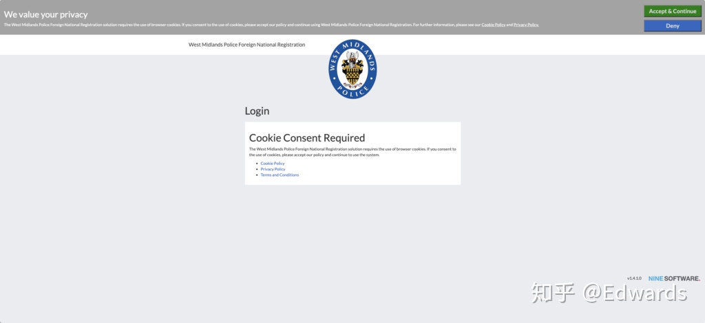
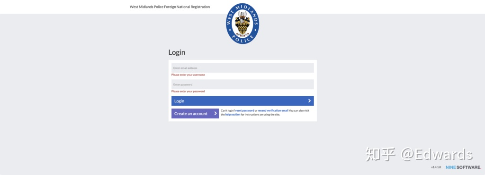
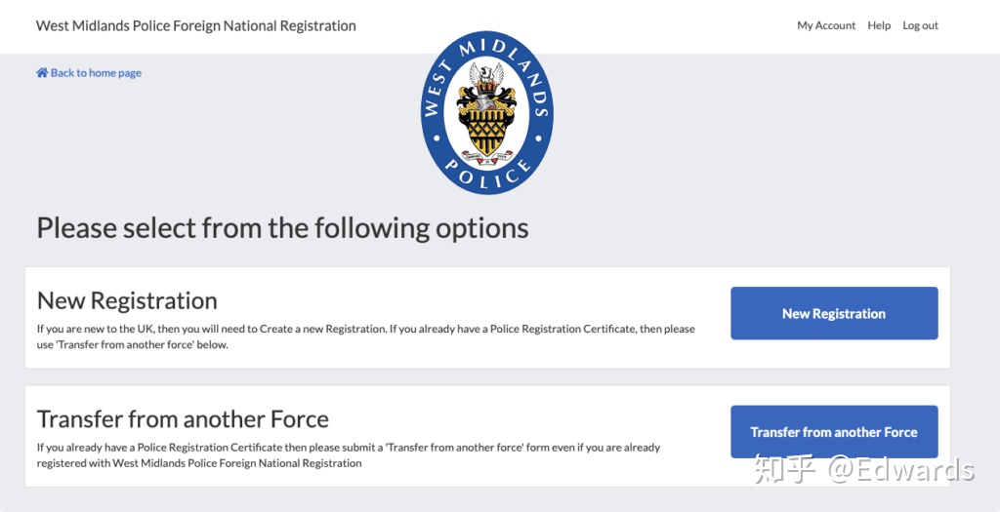
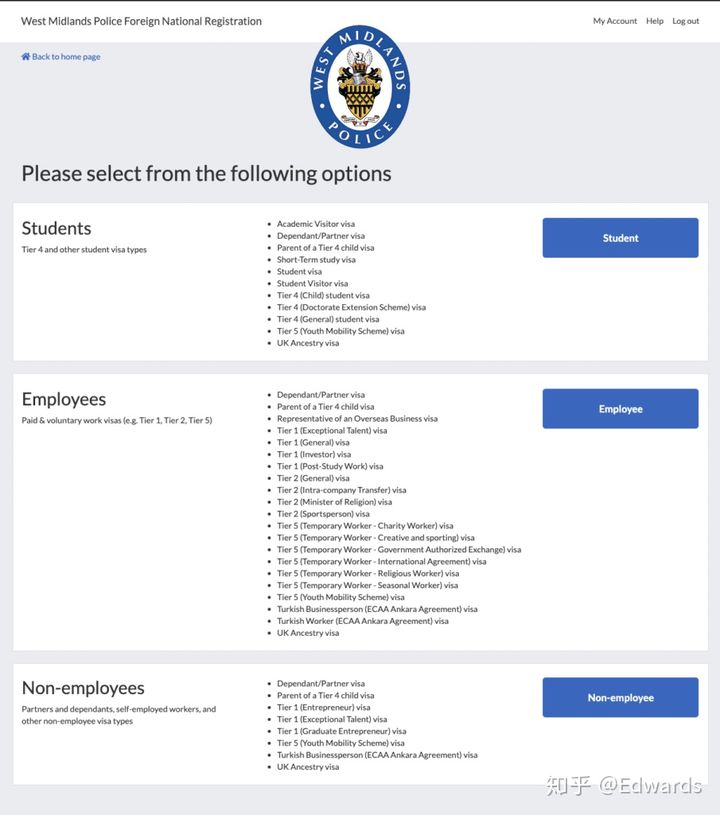
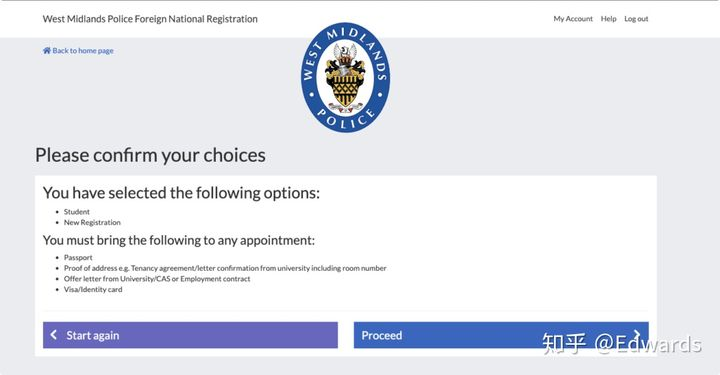
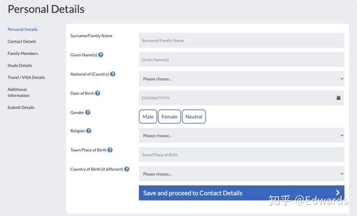
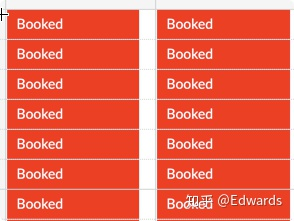
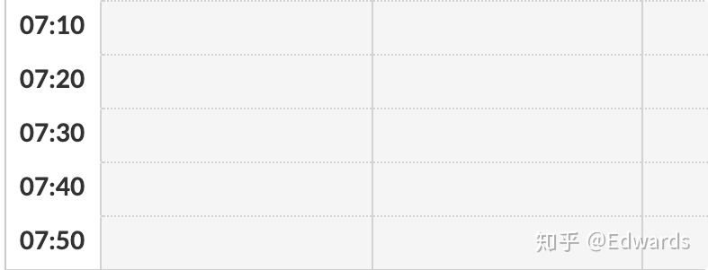
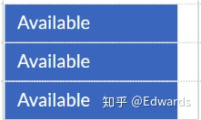

# 🇬🇧 英国留学

## 行前准备

### 成绩

不同的院校要求不同，请参考 Offer 和学校官网上的信息

### 存款

:::tip
参考：

-   [英国政府官方文件 - Student Route 指导 (v3.0 April 2021)](https://assets.publishing.service.gov.uk/government/uploads/system/uploads/attachment_data/file/976139/student-route-casework-guidance-v3.0-ext.pdf)

:::

#### 存款时间

> 办理签证的前 **28** 天在银行存入**定期存款**，需开**存单** / **存款证明**，若 9 月左右开学，存款时间大概为 7 月中旬，8 月中办签证

#### 存多少钱

> 根据**参考文件**规定，每月标准费用（住宿费 + 生活费）为 1,023 英镑（伦敦地区为 1,334 英镑），假设你的学费为 25,000 英镑，存款应当为 $25,000 + 9 \times 1,023 = 34,207$ 英镑

#### 其他问题

> -   已经付完学费，需要存多少钱，只用存 $1,023 \times 9 = 9,207$ 英镑即可，办理签证时需带上学费缴纳证明以备查验
> -   大型银行开具的存款存单和存款证明才能被签证中心接受，如果存入农村（商业）银行、信用社等在国际上低知名度的银行，证明或不被签证中心接受
> -   存款需在确认收到签证确认无误后才能取出
> -   保证金证明采用抽查制，如果被选中，才需要提交**存款证明**

### 肺结核体检 (TB)

:::tip
参考：

-   [英国政府官方文件 - 获批准的肺结核病检测诊所](https://www.gov.uk/government/publications/tuberculosis-test-for-a-uk-visa-clinics-in-china/approved-tuberculosis-testing-clinics-in-china)

:::

### 签证（Visa）

:::tip

参考：

-   [英国政府官网 - Visa](https://www.gov.uk/apply-to-come-to-the-uk)
-   [英国政府官网 - IHS](https://www.gov.uk/healthcare-immigration-application)
-   [英国政府官网 - 在中国申请 Visa](https://www.gov.uk/government/publications/apply-for-a-uk-visa-in-china)
-   [英国政府官网 - 签证费用查询](https://visa-fees.homeoffice.gov.uk/y/china/cny/study/student/all)
-   [英国政府官网 - IHS(Immigration Health Surcharge) 费用查询](https://www.immigration-health-surcharge.service.gov.uk/checker/Type)
-   [vfsglobal - 中国签证中心额外服务](https://www.vfsglobal.co.uk/cn/zh/premium-services)

:::

#### 预约签证

#### 签证费用说明

> 英国签证费用分为两部分：签证费和 IHS(Immigration Health Surcharge，医疗保险费用) 费用
>
> IHS 费用遵循 $n + 0.5$ 的政策，费用不可退
>
> -   本科：3 年就需要交 3.5 年的 IHS 费用，4 年就需要交 4.5 年的 IHS 费用
> -   硕士：1 年就需要交 1.5 年的 IHS 费用

#### 签证审理周期

> 签证平均审理周期为 3 周，即 15 个工作日

#### 签证加急

> 可以签证加急，分为 24 小时加急和 7 天加急，请查看 [VFS](https://www.vfsglobal.co.uk/cn/en/premium-services)

### 行李清单

## 抵达指南

### BRP

#### BRP 寄送地址

> -   寄送至大学，由学校签收（推荐）
>
> 在收到护照时，还会收到一封 BRP 取件信，但是上面的地址是学校默认的地址，可能与学校所展示的地址不同。学校官网有相关的流程有关如何领取 BRP，请参考学校官网。
>
> -   寄送至邮局，由邮局代收，个人自取
>
> 在申请签证时填写正确的个人地址，系统会分配最近的邮局，在收到护照时，会收到一封 BRP 取件信，按照地址在抵英的 **7 个工作日** 内去指定邮局取 BRP 即可。 (需提供护照等个人身份证明文件)

### 电话卡办理

### 银行

#### 国内银行卡

> -   1 张储蓄卡
> -   1 张全球通用信用卡（Visa/Mastercard）

#### 英国银行卡

> 来英办理即可，可能需要出示 Bank Letter （可向学校申请）

### 住宿

#### 校内住宿

#### 校外住宿

### GP 注册

### 英国警局注册

:::tip 提示
[原帖](https://zhuanlan.zhihu.com/p/317481517)发布在知乎，作者：[爱德华兹](https://www.zhihu.com/people/edwards-80)
:::

展开查看内容

#### 准备工作

-   护照
-   BRP / 护照签证
-   学校证明 / 雇员证明
-   34 英镑（目前大部分警局在疫情期间只接受银行卡付款，且大部分警局不接受（即不可以）使用纯银联卡支付，可以使用双币卡）
-   地址证明：（三选一即可）
    -   Bank Statement， 需要在英国有银行卡（是英国银行卡，不是中国银行卡），且英国银行卡使用日期超三个月，并三个月内未更改英国居住地址。
    -   学校开出的 Letter
    -   水电缴费单，也是需要三个月以上（不可以使用租房合同，警局不会接受）

#### 具体警局注册操作

:::tip
这里以**伯明翰**为例，其他警局的操作系统基本一致
:::

1. 访问警局注册网站[https://west-midlands.overseasregistrations.uk/](https://west-midlands.overseasregistrations.uk/)，选择 Accept & Continue 。（否则无法进行下一步）

2. 注册或者登陆账户。

3. 注册会收到一封确认邮件，点击邮件中链接验证

4. 确认后，即可登陆

5. 如果你以前在英国注册过，那么选择 Transfer From Another Force，其他请选择 New Registration

6. 选择你在英国的身份

7. 确认以上内容已经完成，再看下面的内容

8. 选择 Proceed

9. 填写所有个人信息，正确填写，请多次确认信息填写无误

10. 正确填写后，即可 Submit

11. 接下来会收到确认邮件，并要求预约警局时间

12. 需要注意的是，这一步完成后，收到邮件已经证明你成功登记了警局注册，不再受 7 天内 警局注册限制，你接下来需要预约时间到警局登记，时间比较难约，不需要着急，只需要在你签证过期前去登记即可，但是不可以不去登记，这会影响你在英国的生活，乃至以后入境英国都有困难。只要你看到有时间可以预约，请预定位置，提前 10 分钟到达即可。

13. 预约界面，如果显示 Booked ，证明无法预约

14. 预约界面，如果显示 白色 ，证明无法预约，暂时未放出位置，可以多加留意

15. 预约界面，如果显示 灰色 ，证明无法预约，非工作时段

16. 预约界面，如果显示 Available ，证明可以预约

##### 常见问题

1. 警局注册的时间（完成填表）是在入境的 7 天内。警局注册的时间（线下登记）是在 BRP 的有效期内。
2. 签证的上面日期只是规定了入境的时间范围，需要在有效期内入境，但是留英有效期请查看 BRP
3. 如果以前在其他警局注册过，需要带往年注册的确认书，带了就不用交 34 英镑，但是不见了，后果可能很严重
4. 如果以前在其他警局注册过，但是还是不小心选了下面步骤中 New Registration ，没关系，按照第三条讲的做就行
5. 我需要警局注册，但是我要隔离怎么办?  
   先隔离，后拿 BRP ，再注册，不用担心时间限制
6. 我需要去警局注册吗?  
   签证如果有需要你 Police Registration ，那你就需要在伯明翰警局注册  
   请参考学校给出的信息: <http://url.iuob.uk/UoB-Police-Reg-Info>  
   和  
   伯明翰警察局给出的信息: <http://url.iuob.uk/Bham-Police-Reg-Info>
7. 伯明翰警局注册链接 <https://west-midlands.overseasregistrations.uk/>

## 其他

### 留英生活常用联系方式

## 学习

:::tip
有关计算机专业学习方面，可参考 [Harry Yep's Study](https://study.harrly.com)
:::
